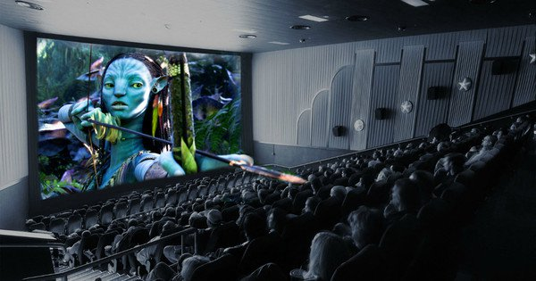

# Design Research

## Part 1

The movie Avatar is a 3D movie that uses stereoscopic imaging technology that allows the audience to feel its depth and three-dimensionality and an immersive feeling when watching the movie. 
The 3D technology in the movie gives a strong visual experience and an immersive viewing experience, demonstrating the impressive power of the imaging technology.

The pictures show the 3D effects of parts of the movie and were able to inspire me to make my task more appealing and present a realistic presentation.

## Part 2

The use of the Sine and Cosine functions in p5.js, along with the 3D drawing capabilities, although not up to the complex imaging techniques used in Avatar movies such as holographic interfaces, can be used to create motion, rotation and oscillation effects on 3D shapes, as well as to generate some interesting 3D patterns that can help to achieve some visually appealing effects.

Here's what I found to show the effect of the programming:

  

[A link to an example code](https://p5js.org/zh-Hans/examples/3d-sine-cosine-in-3d.html)

There may be better coding languages to perform this stereo imaging technique, I'll keep exploring!

